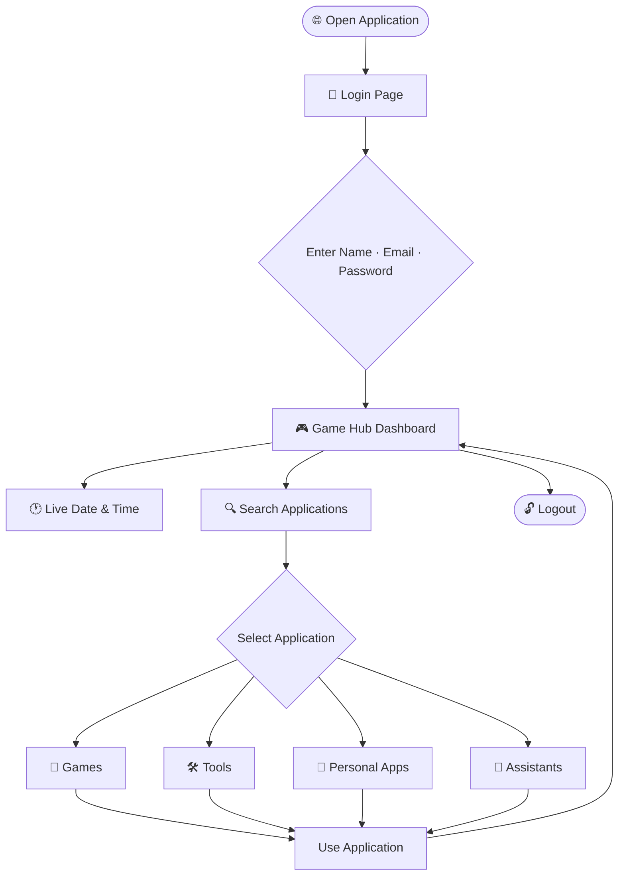

<div align="center">


<br>

[](https://git.io/typing-svg)

<br>


<br>

[](https://github.com/ArunaKumarGouda/HTML-CSS-JavaScript/stargazers)
[](https://github.com/ArunaKumarGouda/HTML-CSS-JavaScript/network/members)
[](https://github.com/ArunaKumarGouda/HTML-CSS-JavaScript/issues)
[](https://github.com/ArunaKumarGouda/HTML-CSS-JavaScript/commits)

</div>

---

## 📌 Table of Contents

- [Overview](#-overview)
- [Dashboard Preview](#-dashboard-preview)
- [Features at a Glance](#-features-at-a-glance)
- [Application Showcase](#-application-showcase)
- [User Flow](#-user-flow)
- [Project Architecture](#-project-architecture)
- [Tech Stack](#-tech-stack)
- [Getting Started](#-getting-started)
- [Usage](#-usage)
- [Learning Outcomes](#-learning-outcomes)
- [Future Improvements](#-future-improvements)
- [Developer](#-developer)
- [Support](#-support)

---

## 🧩 Overview

**Aruna Game Hub** is a multi-functional, browser-based web application that brings together games, productivity utilities, personal tools and interactive assistants into a single centralized dashboard — all built purely with **HTML5, CSS3 and JavaScript**.

The application begins at a **login screen** where the user provides their name, email and password. After authentication, they enter the main **Game Hub Dashboard** — a dark, glassmorphism-styled interface featuring:

- 🔐 Login / Logout functionality
- 👤 Personalized welcome message
- 🕐 Live date and time display
- 🔍 Application search box
- 🗂️ Twelve interactive application cards
- 🎨 Animated modern UI with dark glassmorphism design

---

## 🖥️ Dashboard Preview

<div align="center">


*The main Game Hub Dashboard — featuring the application grid, live clock, search bar and personalized welcome message.*

</div>

---

## ✨ Features at a Glance

| Module | Type | Description |
|---|---|---|
| 🎯 Tic Tac Toe | Game | Two-player classic grid game with winner detection |
| 🏎️ Car Racing | Game | Keyboard-controlled browser racing game |
| 🏃 Endless Runner | Game | Obstacle-based endless running game with scoring |
| ⌨️ Typing Test | Tool | Typing speed and accuracy test with results |
| 📄 Resume | Personal | Animated personal resume with full sections |
| 🌦️ Weather | Tool | Weather information interface with search |
| 🧮 Calculator | Tool | Full-featured basic calculator |
| 👤 Biodata | Personal | JavaScript CRUD-based biodata manager |
| 🤖 AI Chatboard | Assistant | Interactive frontend chatbot assistant |
| ♟️ Chess | Game | Two-player interactive chess game |
| 🎙️ Voice Assistant | Assistant | Voice-command browser assistant via Web Speech API |
| 💼 Portfolio | Personal | Developer portfolio with skills and contact info |

---

## 🚀 Application Showcase

### 🎯 Tic Tac Toe

A browser-based implementation of the classic Tic Tac Toe game for two players.

**Features:**
- Interactive 3×3 game grid
- Two-player turn-based gameplay (X and O)
- Automatic winner detection
- Draw detection
- Game reset / restart functionality

---

### 🏎️ Car Racing

A fast-paced, keyboard-controlled car racing game running entirely in the browser.

**Features:**
- Player-controlled car using keyboard input
- Moving obstacle/traffic system
- Collision detection and game-over logic
- Score tracking during gameplay

---

### 🏃 Endless Runner

An endless runner game where the player character must avoid incoming obstacles.

**Features:**
- Continuous scrolling gameplay
- Obstacle generation and collision detection
- Real-time score tracking
- Increasing difficulty as score grows
- Keyboard interaction for jumping/actions

---

### ⌨️ Typing Test

A typing speed and accuracy measurement tool.

**Features:**
- Timed typing session
- Words-per-minute (WPM) calculation
- Accuracy percentage display
- Performance result summary

---

### 📄 Resume

An animated personal resume rendered entirely in the browser.

**Features:**
- Professional resume layout
- Skills section
- Education history
- Projects section
- Achievements
- Contact information
- CSS animation effects

---

### 🌦️ Weather

A weather information interface for checking current conditions.

**Features:**
- City/location search functionality
- Weather condition display
- Temperature and related details
- API-based data retrieval

---

### 🧮 Calculator

A clean, interactive calculator for standard mathematical operations.

**Features:**
- Addition, Subtraction, Multiplication, Division
- Percentage calculation
- Clear / reset functionality
- Keyboard-friendly interactive UI

---

### 👤 Biodata

A personal biodata manager built with JavaScript, supporting full CRUD operations.

**Features:**
- **Create** — Add new biodata records
- **Read** — View all saved records dynamically
- **Update** — Edit existing records
- **Delete** — Remove records
- All data handled dynamically via JavaScript (client-side)

---

### 🤖 AI Chatboard

An interactive frontend chatbot assistant that responds to user input.

**Capabilities:**
- Performs basic mathematical calculations
- Answers general knowledge questions
- Responds to Java and programming-related queries
- Displays an image when the user provides a valid image URL
- Handles basic conversational messages

> **Note:** The AI Chatboard is a frontend JavaScript implementation. It does not use an external LLM or AI API — responses are handled through predefined JavaScript logic.

---

### ♟️ Chess

A fully playable two-player chess game in the browser.

**Features:**
- Interactive visual chessboard
- All chess piece types rendered
- Click-based piece movement
- Two-player local gameplay

---

### 🎙️ Voice Assistant

A voice-controlled browser assistant powered by the **Web Speech API**.

**Capabilities:**
- Recognizes spoken commands
- Opens websites (e.g. "Open YouTube", "Open Google")
- Performs browser searches (e.g. "Search Java on Google")
- Answers basic spoken queries (e.g. "What is Java?")

> **Technology:** Uses the browser's built-in `SpeechRecognition` interface (Web Speech API). Browser compatibility may vary — works best in Chrome.

---

### 💼 Portfolio

A personal developer portfolio embedded within the Game Hub.

**Features:**
- Developer introduction and profile
- Skills showcase
- Projects section
- Professional information
- Contact and social media links

---

## 🔄 User Flow



---

## 📁 Project Architecture

```
Aruna Game Hub/
│
├── Login/                  ← Login page (HTML, CSS, JS)
│
├── Dashboard/              ← Main hub dashboard
│
├── Tic Tac Toe/            ← Tic Tac Toe game
│
├── Car Racing/             ← Car racing game
│
├── Endless Runner/         ← Endless runner game
│
├── Typing Test/            ← Typing speed test
│
├── Resume/                 ← Animated personal resume
│
├── Weather/                ← Weather application
│
├── Calculator/             ← Calculator tool
│
├── Biodata/                ← CRUD biodata manager
│
├── AI Chatboard/           ← Frontend chat assistant
│
├── Chess/                  ← Chess game
│
├── Voice Assistant/        ← Web Speech API assistant
│
├── Portfolio/              ← Personal portfolio
│
└── assets/                 ← Images and static assets
    └── game-hub-dashboard.png
```

> **Note:** The folder names above are illustrative. Refer to the actual repository structure for exact file and folder names.

---

## 🛠️ Tech Stack

| Technology | Purpose |
|---|---|
| **HTML5** | Page structure and semantic markup |
| **CSS3** | Styling, animations and glassmorphism design |
| **JavaScript (ES6+)** | Application logic, interactivity and DOM manipulation |
| **DOM API** | Dynamic content rendering and event handling |
| **Web Speech API** | Voice recognition for the Voice Assistant |
| **Fetch / Browser APIs** | External data retrieval (Weather module) |

---

## ⚙️ Getting Started

### Prerequisites

- A modern web browser (Chrome recommended for Voice Assistant)
- [VS Code](https://code.visualstudio.com/) with the [Live Server](https://marketplace.visualstudio.com/items?itemName=ritwickdey.LiveServer) extension *(recommended)*

### Installation

**1. Clone the repository**

```bash
git clone https://github.com/ArunaKumarGouda/HTML-CSS-JavaScript.git
```

**2. Navigate to the project directory**

```bash
cd HTML-CSS-JavaScript
```

**3. Open the project**

**Option A — Using VS Code Live Server (recommended):**
```
1. Open the project folder in VS Code
2. Right-click the Login page HTML file
3. Select "Open with Live Server"
```

**Option B — Direct browser:**
```
Open the Login HTML file directly in your web browser
```

No build tools, package managers or server configuration required.

---

## 📖 Usage

| Step | Action |
|---|---|
| **1** | Open the application in your browser |
| **2** | Enter your Name, Email and Password on the Login page |
| **3** | Submit to enter the Game Hub Dashboard |
| **4** | View the live date and time displayed on the dashboard |
| **5** | Use the search box to find a specific application |
| **6** | Click any application card to open it |
| **7** | Interact with the selected game, tool or assistant |
| **8** | Return to the dashboard and explore other applications |
| **9** | Click Logout to return to the Login page |

---

## 📚 Learning Outcomes

This project demonstrates hands-on application of the following skills:

- ✅ HTML5 document structure and semantic elements
- ✅ CSS3 styling, flexbox, grid and glassmorphism design
- ✅ CSS animations and transitions
- ✅ JavaScript programming and ES6+ syntax
- ✅ DOM manipulation and dynamic content rendering
- ✅ Event handling and user interaction
- ✅ JavaScript arrays, objects and functions
- ✅ Conditional logic and control flow
- ✅ Game logic design and implementation
- ✅ CRUD operations using JavaScript
- ✅ Search and filter functionality
- ✅ Browser APIs (Web Speech API, Fetch API)
- ✅ Voice recognition and command parsing
- ✅ API data integration (Weather module)
- ✅ Responsive UI design
- ✅ Multi-module project organization

---

## 🔮 Future Improvements

The following enhancements are planned or proposed for future versions:

- [ ] Real backend authentication (Node.js / Spring Boot)
- [ ] Database integration for persistent user data
- [ ] User accounts and saved sessions
- [ ] Cloud storage for biodata records
- [ ] Game leaderboards with high scores
- [ ] Additional games and tools
- [ ] Advanced AI chatbot integration via an actual AI API
- [ ] Improved voice commands with broader browser support
- [ ] Progressive Web App (PWA) support
- [ ] Full mobile optimization and touch controls
- [ ] Deployment to a cloud hosting platform
- [ ] User activity statistics and analytics
- [ ] Online multiplayer support for Chess and Tic Tac Toe

> These are proposed future improvements and are **not** part of the current implementation.

---

## 👨‍💻 Developer

<div align="center">

### Aruna Kumar Gouda

*Computer Science & Engineering Student | Aspiring Java Full Stack Developer*

<br>

[](https://github.com/ArunaKumarGouda)
[](https://www.linkedin.com/in/aruna-kumar-gouda-3997b9359)

</div>

---

## ⭐ Support

If you found this project useful or interesting, consider giving it a star — it helps others discover the project and motivates continued development.

<div align="center">

[](https://github.com/ArunaKumarGouda/HTML-CSS-JavaScript/stargazers)

</div>

---

<div align="center">


</div>
