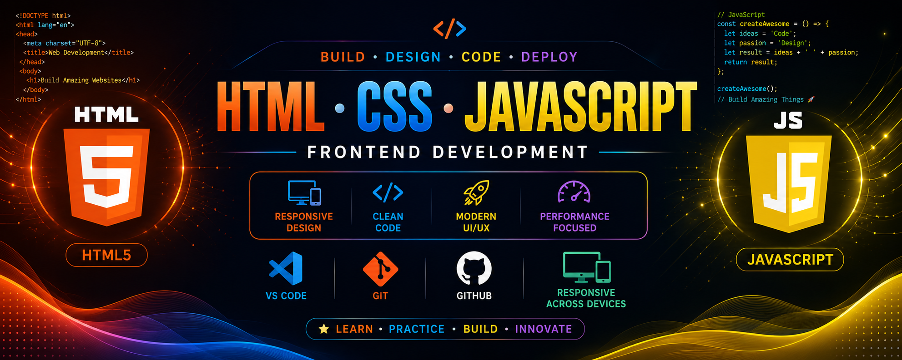

<p align="center">
  
</p>

<h1 align="center">🌐 HTML • CSS • JavaScript</h1>

<h3 align="center">
Frontend Development • Responsive Design • Modern Web Development
</h3>

<p align="center">

</p>

<p align="center">


</p>

---

# 📖 About

Welcome to my **HTML-CSS-JavaScript Repository**.

This repository contains frontend development projects ranging from beginner to advanced, focusing on responsive web design, interactive user interfaces, animations, and JavaScript programming.

The goal is to strengthen my frontend development skills by building real-world projects and improving UI/UX design.

---

# 🎯 Learning Objectives

- Learn HTML5 from Beginner to Advanced
- Master CSS3 Styling & Layouts
- Build Responsive Websites
- Understand Flexbox & CSS Grid
- Learn JavaScript Programming
- Practice DOM Manipulation
- Build Interactive Web Applications
- Consume REST APIs using Fetch API
- Create Modern UI/UX Designs
- Prepare for Frontend Development

---

# 📚 Topics Covered

## 🟠 HTML5

- HTML Structure
- Semantic Tags
- Forms
- Tables
- Lists
- Media
- Accessibility

## 🔵 CSS3

- Selectors
- Colors
- Box Model
- Flexbox
- Grid
- Positioning
- Transitions
- Animations
- Responsive Design

## 🟡 JavaScript

- Variables
- Data Types
- Operators
- Functions
- Arrays
- Objects
- Loops
- DOM Manipulation
- Events
- ES6 Features
- Fetch API
- Local Storage

---

# 🛠 Technologies Used

<p align="center">


</p>

---

# 📈 Learning Progress

```text
HTML5              ████████████████████ 100%
CSS3               ██████████████████░░ 90%
Responsive Design  █████████████████░░░ 85%
JavaScript         ███████████████░░░░░ 80%
DOM Manipulation   █████████████░░░░░░░ 65%
ES6                ████████████░░░░░░░░ 60%
Fetch API          █████████░░░░░░░░░░░ 45%
```

---

# 🗺️ Frontend Learning Roadmap

```text
HTML5
   │
   ▼
CSS3
   │
   ▼
Flexbox
   │
   ▼
CSS Grid
   │
   ▼
Responsive Design
   │
   ▼
JavaScript
   │
   ▼
DOM Manipulation
   │
   ▼
ES6
   │
   ▼
Fetch API
   │
   ▼
Frontend Projects
```

---

# 🚀 Featured Projects

| Project | Description |
|---------|-------------|
| 🌐 Personal Portfolio | Responsive portfolio website showcasing skills and projects. |
| 🧮 Calculator | Calculator built with HTML, CSS, and JavaScript. |
| 🌦 Weather App | Real-time weather application using Fetch API. |
| ✅ To-Do List | Task management app with Local Storage support. |
| ⏱ Digital Clock | Live digital clock using JavaScript. |
| ⏲ Stopwatch | Stopwatch with start, stop, and reset functionality. |
| 🔐 Login Page | Modern responsive authentication UI. |
| 🛒 E-Commerce Landing Page | Responsive shopping website homepage. |
| 🎵 Music Player | Audio player built with JavaScript. |
| 🖼 Image Gallery | Interactive gallery with lightbox effect. |

---

# 💼 Frontend Skills

| Skill | Status |
|-------|:------:|
| HTML5 | ✅ |
| CSS3 | ✅ |
| Responsive Design | ✅ |
| Flexbox | ✅ |
| CSS Grid | ✅ |
| JavaScript Basics | ✅ |
| DOM Manipulation | 🟡 Learning |
| ES6 | 🟡 Learning |
| Fetch API | 🟡 Learning |
| Local Storage | 🟡 Learning |
| REST API | 🔄 Coming Soon |
| React | 🔄 Coming Soon |

---

# 🚀 Future Plans

- ⚛ React.js
- 🎨 Tailwind CSS
- 🅱 Bootstrap
- 📘 TypeScript
- 🌐 Next.js
- 🔗 REST API Integration
- 📱 Progressive Web Apps (PWA)
- 🎭 Advanced CSS Animations
- 🚀 Full-Stack Web Applications

---

# 📚 Learning Resources

- MDN Web Docs
- JavaScript.info
- CSS Tricks
- FreeCodeCamp
- W3Schools
- Google Web.dev

---

# 🤝 Contributing

Contributions, suggestions, and improvements are always welcome.

If you'd like to contribute:

1. Fork the repository
2. Create a new branch
3. Commit your changes
4. Push your branch
5. Open a Pull Request

---

# ⭐ Support

If you find this repository useful, consider giving it a ⭐.

Happy Coding! 🌐🚀
